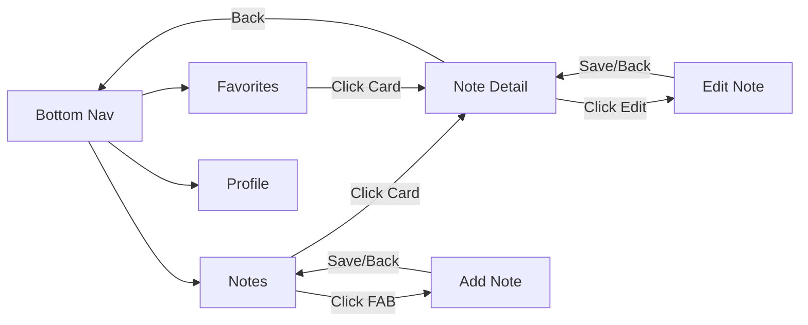

# 📝 Tugas 5 - Notes App Navigation

<p align="center">
  
  
  
</p>

## 👤 Informasi Mahasiswa
| Data Diri | Keterangan |
| :--- | :--- |
| **Nama** | Awi Septian Prasetyo |
| **NIM** | 123140201 |
| **Mata Kuliah** | Pengembangan Aplikasi Mobile (PAM) |
| **Program Studi** | Teknik Informatika |
| **Institusi** | Institut Teknologi Sumatera (ITERA) |

---

## 📖 Deskripsi Proyek
Proyek ini merupakan implementasi **Tugas Praktikum Minggu 5** yang berfokus pada **Navigasi Antar Layar** menggunakan **Navigation Compose** pada **Compose Multiplatform**.

Aplikasi yang dikembangkan adalah **Notes App**. Selain fitur navigasi standar, aplikasi ini mengintegrasikan **Halaman Profile dari Tugas 4**, yang sudah memiliki pola **MVVM**, tampilan responsif, dan dukungan *Dark Mode* yang matang.

### 🎯 Tujuan Tugas
1.  **Bottom Navigation:** Implementasi 3 tab utama (**Notes**, **Favorites**, **Profile**).
2.  **Detail Navigation:** Perpindahan dari *Note List* ke *Note Detail* dengan **passing argument** `noteId`.
3.  **Floating Action Button (FAB):** Navigasi cepat untuk membuka *Add Note Screen*.
4.  **Back Stack Management:** Penerapan navigasi balik (*back navigation*) yang benar pada seluruh layar.
5.  **Edit Feature:** Implementasi *Edit Note Screen* dengan sinkronisasi data via `noteId`.

---

## 📱 Hasil Video & Screenshot

### 🎥 Demo Video
> **Tonton demo aplikasi di sini:** > [🔗 Video Demo Aplikasi - Google Drive](https://drive.google.com/drive/folders/1_LfpLpUr39LGJHy_cD_H-1eySeB6txRK?usp=drive_link)

### 📸 Screenshot Dokumentasi

| Fitur | Light Mode | Dark Mode |
| :--- | :---: | :---: |
| **Notes Screen** |  |  |
| **Favorites Screen** |  |  |
| **Profile Screen** |  |  |
| **Add Note Screen** |  |  |

---

## 🛠️ Konsep & Teknologi
Aplikasi ini dibangun dengan prinsip-prinsip berikut:
* **Navigation Compose:** `NavHost`, `NavController`, dan `NavBackStackEntry`.
* **State Management:** Menggunakan ViewModel untuk menjaga integritas data antar screen.
* **UI Components:** Material 3, Scaffold, BottomAppBar, dan FloatingActionButton.

---

## 🚦 Alur Navigasi (Navigation Flow)



-----

## 📂 Struktur Folder

```text
composeApp/src/commonMain/kotlin/org/example/project/
├── data/               # Model data (Note, Profile)
├── viewmodel/          # Business logic & UI State
├── navigation/         # Konfigurasi Routes & NavHost
│   ├── Screen.kt       # Definisi Route
│   ├── BottomNavBar.kt # UI Bottom Navigation
│   └── AppNavigation.kt
├── components/         # Reusable UI (Card, Form, dll)
└── ui/screens/         # Layout halaman utama
    ├── NotesScreen.kt
    ├── FavoritesScreen.kt
    ├── ProfileScreen.kt
    ├── NoteDetailScreen.kt
    ├── AddNoteScreen.kt
    └── EditNoteScreen.kt
```
